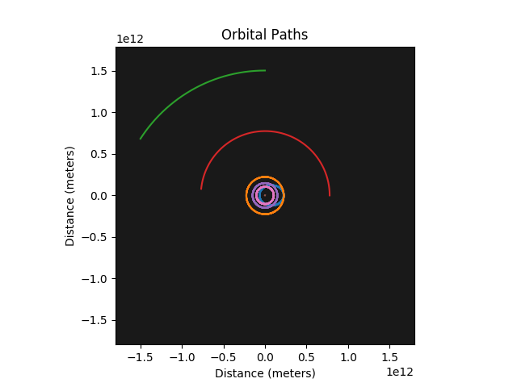
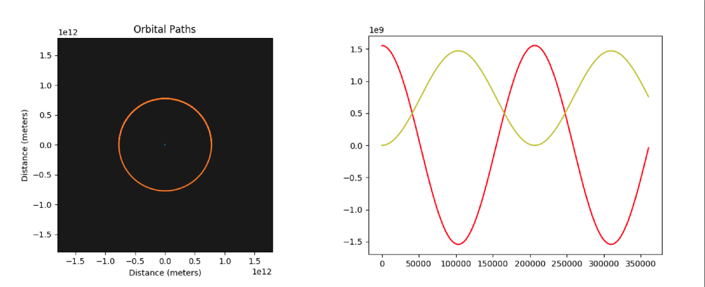
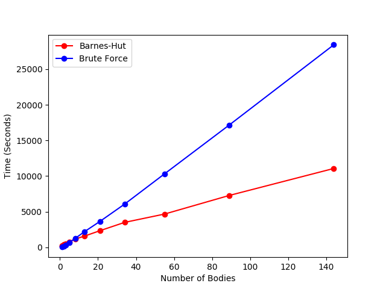

# N-Body Simulator

A pretty-much-functional, astronomically-motivated n-body simulator.

## Motivation:
This was written as a class project in the fall of 2017, I have used it as a side-project since then as a way to work on following best-practice guidelines, as well as adding some small improvements here and there.

## Features:
The package has two primary functions: running an n-body sim by brute force (calculating the force contribution from every body in the system in each step), or running one using Barnes-Hut gridding, which uses some simple approximations to limit the number of force contributions that need to be calculated at each step, reducing the computational cost of a run pretty significantly (from O(n2) to O(n logn))).

## Structure:
This package is structured to be run with a simple '''python python run_driver.py'''. From this point, the user may choose a brute-force or barnes-hut run.

**run_driver.py** initiates a run, as chosen by the user.

**constants.py** just centralizes all the constants we use (i.e. physical constants, path names, and so on).

**barnes_hut_gridding.py** sets up *tree* and *node* objects. The *tree* object holds the whole system of bodies, and has a bunch of features, including a run-initiator, visualization stuff, and a bunch of others.

**brute_force.py** sets up the equivalent structures for a brute-force run, except for that we don't need to treat this one as a graph so things are a little simpler in it.

**body.py** holds the actual body object definition that is used throughout to create bodies (i.e. planets, stars, planetesimals). Nice and simple.

**analysis.py** holds some functions to deal with/analyze the output files of a completed run (plotting, mostly).

**time_analysis.py** has functionality to run sims of varying number of bodies (number increases follow the Golden Ratio) and log how long those runs take. It also has a function to do that for both methods and plot a comparison of the two, which should return a plot like the one shown above. This is currently untested.

## Visualization:
The results can be visualized in a couple different ways:

First, as a simple trajectory plot, for both brute-force and barnes-hut methods:

If we have a Barnes-Hut run, we can gif the graph evolution (two here because I just love how they look):

We may also plot the RV curve of a system, comparing it with the trajectory plot above.

By running a bunch of sims, we can plot the time-cost. This demonstrates that the Barnes-Hut gridding is actually doing its job and creating a log cost.

## To-Do:
* It would be nice to have each run set up its own directory and store its output in there, just to simplify things.
