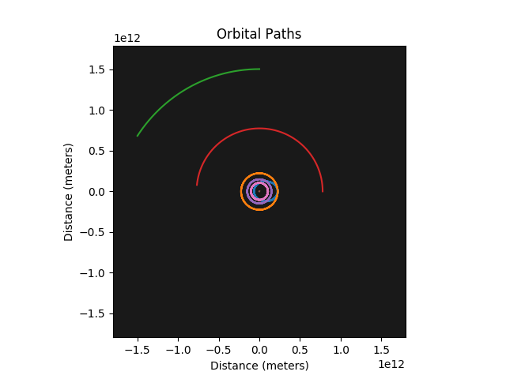
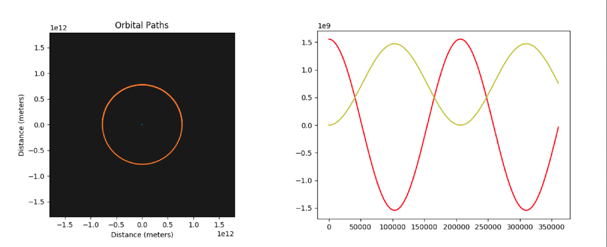
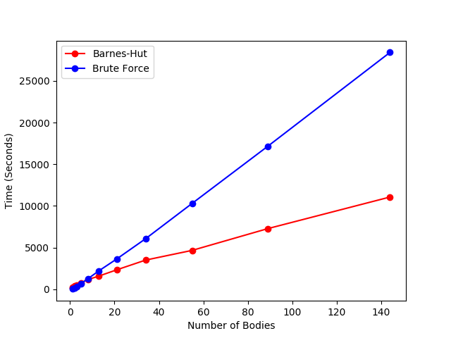

## N-Body Simulator

A pretty-much-functional, astronomically-motivated n-body simulator.

### Motivation:

This was written as a class project in the fall of 2017, I have used it as a side-project since then as a way to work on following best-practice guidelines, as well as adding some small improvements here and there.

### Features:

The package has two primary functions: running an n-body sim by brute force (calculating the force contribution from every body in the system in each step), or running one using Barnes-Hut gridding, which uses some simple approximations to limit the number of force contributions that need to be calculated at each step, reducing the computational cost of a run pretty significantly (from O(n$^2$ to O(n logn))).

The results are visualized in a couple different ways:

